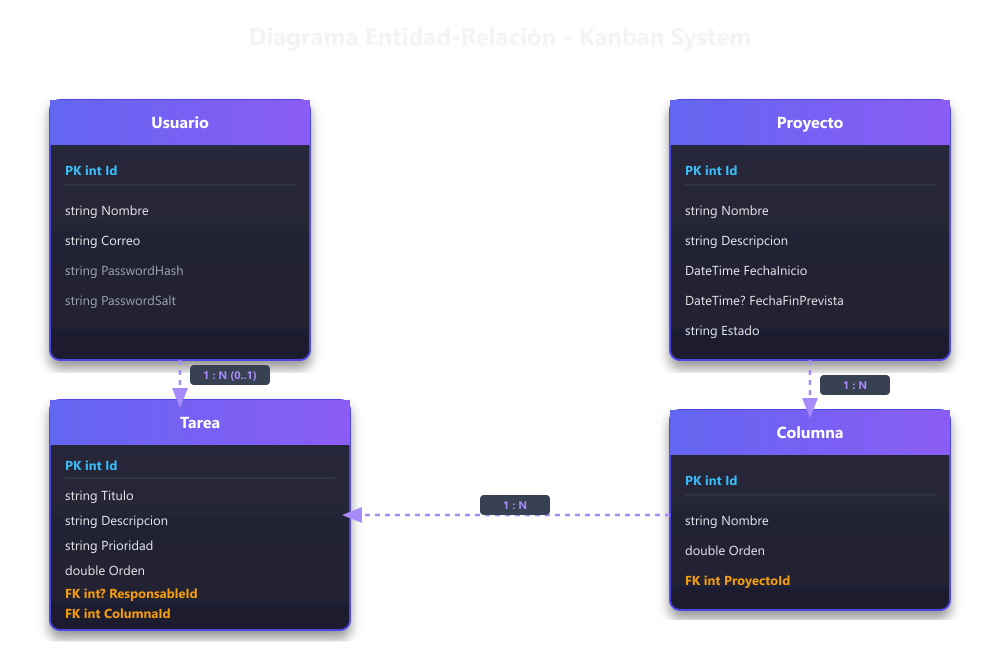

# Kanban Agile Project Management

Plataforma web de gestión de proyectos ágiles basada en tableros Kanban interactivos.

Permite administrar proyectos, personalizar flujos de trabajo mediante columnas dinámicas y gestionar tareas en tiempo real mediante arrastre y soltar (Drag & Drop), con exportación dual de reportes (PDF y Excel) alimentados por una única consulta a la base de datos.

---

## 🚀 1. Requisitos Previos e Instalación

### Opción A: Despliegue Automatizado con Docker (Recomendado)

El proyecto está 100% contenedorizado con **Docker** y **Docker Compose** para garantizar un entorno reproducible e independiente de SDKs locales.

1. Clonar el repositorio:
   ```bash
   git clone https://github.com/tu-usuario/Kanban_SamVP.git
   cd Kanban_SamVP
   ```
2. Asegurar que el archivo `.env` existe en la raíz (puedes duplicar `.env.example`):
   ```bash
   cp .env.example .env
   ```
3. Ejecutar los servicios en segundo plano:
   ```bash
   docker-compose up -d --build
   ```

Los servicios quedarán disponibles de inmediato en:
- 🌐 **Frontend (Angular 17 SPA):** `http://localhost:4200`
- ⚡ **Backend REST API (.NET 8):** `http://localhost:8080/api`
- 🗄️ **Base de Datos (PostgreSQL 15):** `localhost:5432`

Para detener y limpiar los contenedores:
```bash
docker-compose down -v
```

---

### Opción B: Ejecución Local (Manual)

**Requisitos:** .NET 8 SDK, Node.js v20+, Angular CLI 17, PostgreSQL 15+.

1. **Base de Datos:** Crear una BD PostgreSQL llamada `kanban_db`.
2. **Backend:**
   ```bash
   cd backend
   dotnet ef database update --project Kanban.Infrastructure --startup-project Kanban.WebApi
   dotnet run --project Kanban.WebApi
   ```
3. **Frontend:**
   ```bash
   cd frontend
   npm install
   ng serve
   ```

---

## 🗄️ 2. Migraciones y Usuarios de Prueba (Data Seeding)

### Ejecución Automática de Migraciones
La base de datos PostgreSQL se sincroniza automáticamente mediante **Entity Framework Core Migrations**.
- **En entorno contenedorizado (Docker / Producción):** Al ejecutar `docker-compose up`, la aplicación backend invoca `db.Database.Migrate()` en `Program.cs`, creando las tablas, relaciones e índices automáticamente sin intervención manual.
- **En entorno manual (CLI):** Puedes aplicar o generar migraciones con los siguientes comandos desde la carpeta `backend/`:
  ```bash
  # Crear una nueva migración
  dotnet ef migrations add <NombreMigracion> --project Kanban.Infrastructure --startup-project Kanban.WebApi

  # Aplicar migraciones pendientes
  dotnet ef database update --project Kanban.Infrastructure --startup-project Kanban.WebApi
  ```

### Datos Semilla Precargados (Data Seeding)
En `ApplicationDbContext.cs` (`SeedData`), se precargan los usuarios iniciales cifrados con **BCrypt** (coste 11):

| Usuario | Correo Electrónico | Contraseña | Rol / Propósito |
| :--- | :--- | :--- | :--- |
| **Usuario 1** | `admin@kanban.com` | `Password123!` | Administrador / Pruebas multi-sesión |
| **Usuario 2** | `tester@kanban.com` | `Password123!` | Evaluador / Pruebas de tiempo real |

---

## 🏗️ 3. Arquitectura y Estructura del Sistema

El aplicativo implementa **Arquitectura Hexagonal (Puertos y Adaptadores)** en el Backend y una estructura modular limpia por capas en el Frontend Angular.

### Estructura de Carpetas

```text
Kanban_SamVP/
├── backend/
│   ├── Kanban.Domain/          # Núcleo de Dominio (Entidades puras, Interfaces de repositorios)
│   ├── Kanban.Application/     # Casos de Uso (DTOs, Servicios de Negocio, Reportes Strategy)
│   ├── Kanban.Infrastructure/  # Adaptadores (DbContext EF Core, Repositorios, QuestPDF, EPPlus)
│   ├── Kanban.WebApi/          # Presentación HTTP (Controllers REST, Hubs SignalR, Program.cs)
│   └── Kanban.UnitTests/       # Pruebas Automatizadas Backend (xUnit, Moq, FluentAssertions)
│
├── frontend/src/
│   ├── app/
│   │   ├── core/               # ⚙️ Servicios globales (auth.service, kanban.service, guard, interceptor)
│   │   ├── features/           # 🧩 Módulos de negocio (projects-list, board kanban)
│   │   ├── pages/              # 📄 Páginas de sistema (login, access denied, not found 404)
│   │   ├── layout/             # 🎨 Layout Sakai (app.layout, topbar, sidebar, footer)
│   │   ├── app-routing.module.ts
│   │   └── app.module.ts
│   └── assets/                 # 🖼️ Recursos estáticos (imágenes SVG, estilos SCSS)
│
├── docker-compose.yml
└── README.md
```

### Limpieza y Refactorización del Frontend (Plantilla Sakai)
Para evitar archivos irrelevantes y garantizar la mantenibilidad del código:
1. **Depuración de carpetas demo:** Se eliminaron las carpetas residuales `src/app/demo` y `src/assets/demo`.
2. **Organización en `pages/`:** Las páginas de autenticación (Login, Access Denied) y error (Not Found 404) se trasladaron a `src/app/pages/`.
3. **Remoción del configurador de temas:** Se eliminó la rueda flotante `<app-config>` que modificaba colores en caliente, dejando la interfaz limpia y enfocada en el tablero Kanban.

### Principios SOLID Aplicados

- **Single Responsibility Principle (SRP):** Controladores atienden HTTP, Servicios ejecutan reglas de negocio, Repositorios gestionan persistencia y Generadores construyen archivos de reporte.
- **Open/Closed Principle (OCP):** El sistema de reportes utiliza el **Patrón Strategy / Factory**. Agregar un nuevo formato (ej. CSV) solo requiere crear una clase que implemente `IReportGenerator` sin tocar clases existentes.
- **Liskov Substitution & Interface Segregation (LSP/ISP):** Inyección de interfaces concisas (`IProyectoRepository`, `IColumnaService`, `IReportGenerator`).
- **Dependency Inversion Principle (DIP):** Las capas superiores (`Domain` y `Application`) no dependen de frameworks externos ni bases de datos, sino de abstracciones (puertos).

---

## 💡 4. Decisiones Técnicas de Diseño

### 1. Sincronización en Tiempo Real: SignalR
- **Elección:** **ASP.NET Core SignalR**.
- **Justificación:** Integración nativa de alto rendimiento con .NET y clientes de JS/Angular. Administra reconexión automática, transporte transparente (WebSockets con fallback) y aislamiento de mensajes por grupo de proyecto (`JoinBoardGroup` / `LeaveBoardGroup`).
- **Alternativas descartadas:**
  - *Server-Sent Events (SSE):* Descartado por ser unidireccional y requerir peticiones HTTP auxiliares para manejar suscripciones.
  - *Raw WebSockets:* Descartado por la necesidad de implementar manualmente reconexión, handshakes y manejo de eventos.
  - *Short Polling:* Descartado por ineficiencia de consultas recurrentes a la base de datos y latencia superior a los 2 segundos requeridos.

### 2. Estrategia de Ordenamiento: Lexicographical Ranking (Espaciado Flotante)
- **Elección:** Campo numérico decimal `Orden` (float/double) en tareas y columnas.
- **Justificación:** Al mover una tarea entre columnas o dentro de la misma columna, la nueva posición se calcula como `(orden_anterior + orden_siguiente) / 2`. Esto **evita reindexar o actualizar masivamente los demás registros en la base de datos** (operación de orden $O(1)$ en lugar de $O(N)$).

### 3. Reportes Duales con Consulta Única (PDF & Excel)
- **Elección:** QuestPDF (PDF) y EPPlus (Excel) guiados por el patrón **Strategy**.
- **Optimización SQL:** Se implementó `GetProyectoCompletoReporteAsync` en `ProyectoRepository` con `.Include(p => p.Columnas).ThenInclude(c => c.Tareas).ThenInclude(t => t.Responsable)`. Se efectúa **una sola consulta SQL a la base de datos** para alimentar ambos formatos, resolviendo el problema de consulta N+1.
- **Filtros Aplicados:** Los reportes aceptan parámetros opcionales (`prioridad`, `responsableId`, `texto`) para exportar exactamente lo que el usuario está visualizando en pantalla.

### 4. Seguridad y Control de Acceso
- **Hashes Criptográficos:** Cifrado con **BCrypt** de coste 11 (salting dinámico integrado).
- **JWT & Interceptor:** Todos los endpoints de negocio exigen token Bearer JWT. El `AuthInterceptor` en Angular adjunta el token y captura automáticamente errores HTTP 401 para cerrar sesión y redirigir al login.

---

## 📊 5. Diagrama del Modelo de Base de Datos (ER)

<p align="center">
  
</p>

---

## ⭐ 6. Funcionalidades Destacadas del Sistema

1. **Gestión de Proyectos:** CRUD completo con listado paginado y filtro por coincidencia parcial resuelto en servidor.
2. **Tablero Kanban Dinámico:** Movimiento de tareas por arrastre y soltar (Drag & Drop) con actualización optimista e instantánea.
3. **Reordenación de Columnas:** Posibilidad de ajustar el orden de las columnas desde la interfaz web.
4. **Sincronización en Tiempo Real:** Actualizaciones instantáneas en sesiones múltiples sin recargar pantalla.
5. **Indicador de Usuarios Conectados (Opcional +5%):** Conteo activo en tiempo real de usuarios presentes en el mismo tablero.
6. **Búsqueda y Filtros Combinados (Opcional +5%):** Filtro de tareas por texto en tiempo real y selectores por Prioridad (Alta/Media/Baja) y Responsable, con botón de limpiado rápido.
7. **Diseño Sakai Depurado:** Plantilla Sakai de PrimeNG optimizada con modales nativos `<p-confirmDialog>` e `InputTextarea` adaptativo.

---

## 🧪 7. Pruebas Automatizadas (Sección 6.9 del PDF)

El proyecto incluye un total de **13 pruebas unitarias automatizadas** (6 en Backend y 7 en Frontend), ejecutando y pasando al 100%.

### Ejecución de Pruebas en Backend (.NET 8 xUnit)
```bash
dotnet test backend/Kanban.UnitTests/Kanban.UnitTests.csproj
```
- **Prueba Obligatoria de Cálculo de Posición:** `CrearTareaAsync_DebeCalcularNuevaPosicionLexicografica_CuandoSeAgregaUnaTarea` (verifica el ranking de posición $maxOrden + 65536$).
- **Regla de Negocio de Columnas:** `DeleteAsync_DebeLanzarExcepcion_CuandoColumnaTieneTareas` (bloquea el borrado de columna no vacía con `InvalidOperationException`).
- **Pruebas de Servicios:** Paginación de proyectos, movimiento de tareas y generación de DTO de reportes.

### Ejecución de Pruebas en Frontend (Angular 17 Jasmine / Karma)
```bash
cd frontend
npm run test -- --watch=false
```
- **`AuthGuard`:** Cobertura de bloqueo de rutas sin token JWT y navegación permitida con sesión activa.
- **`AuthInterceptor`:** Cobertura de inserción del header Bearer y captura de respuestas HTTP 401.
- **`KanbanService`:** Verificación de llamada REST a `PUT /Tareas/mover`.
- **`BoardComponent`:** Filtrado reactivo de tarjetas por búsqueda de texto y prioridad.

---

## 🤖 8. Declaración del Uso de Asistentes de Inteligencia Artificial (IA)

En cumplimiento de las especificaciones de la prueba técnica (Secciones 8 y 9), se declara el uso transparente y supervisado de **Antigravity AI (Gemini 3.6 Flash)** como herramienta auxiliar de desarrollo en las siguientes áreas:

1. **Maquetado y Estilos de Interfaz:** Asistencia en la adaptación de plantillas HTML, estilos SCSS y componentes visuales de PrimeNG (Sakai).
2. **Generación de Código Repetitivo (Boilerplate):** Aceleración en el armado inicial de DTOs de transferencia, enumeraciones y estructuras base.
3. **Documentación y Guías:** Ayuda en la redacción y formateo Markdown del archivo README y la configuración de Docker Compose.
