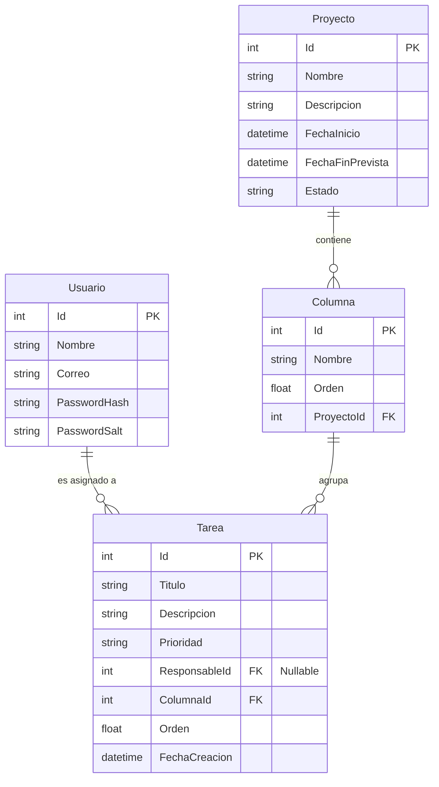

# Kanban Agile Project Management

Plataforma de gestión de proyectos ágiles basada en tableros Kanban, desarrollada para evaluación técnica. Permite crear proyectos, configurar columnas y administrar tareas en tiempo real.

---

## 1. Requisitos Previos

Dependiendo del método de ejecución elegido, necesitarás:

- **Docker y Docker Compose** (Opción recomendada).
- **.NET 8 SDK** (Si se ejecuta localmente).
- **Node.js v20+** y **Angular CLI 17** (Si se ejecuta localmente).
- **PostgreSQL 15+** (Si se ejecuta localmente).

## 2. Ejecución (Docker)

Para garantizar un entorno limpio, profesional y reproducible, la aplicación se despliega utilizando **Docker Compose**. Esto evita conflictos de dependencias, SDKs o versiones locales en la máquina evaluadora.

1. Clonar el repositorio.
2. Asegurarte de copiar el archivo `.env.example` y renombrarlo a `.env` en la raíz del proyecto.
3. Abrir una terminal en la raíz del proyecto y ejecutar:

```bash
docker-compose up -d --build
```

Esto levantará los siguientes servicios automáticamente:
- **Base de Datos (PostgreSQL)** en el puerto `5432`
- **Backend (.NET API)** en el puerto `8080`
- **Frontend (Angular)** en el puerto `4200` (accesible vía Nginx).

Para detener y limpiar los contenedores:
```bash
docker-compose down -v
```

## 4. Variables de Entorno

El proyecto se configura mediante un archivo `.env` en la raíz (para Docker) o a través de las variables de entorno / `appsettings.json` en ejecución local. El archivo `.env.example` contiene los valores por defecto que se utilizarán para inicializar el contenedor de Postgres y el Backend. No existen secretos versionados en este repositorio.

## 5. Ejecutar Migraciones

**Si usas Docker:**
Las migraciones se ejecutan automáticamente al arrancar el contenedor del backend (implementado en el pipeline de inicio de la API), generando la estructura de la base de datos de manera automatizada para mayor comodidad.

**Si usas Local:**
Abre una terminal en `/backend` y ejecuta:
```bash
dotnet ef database update --project Kanban.Infrastructure --startup-project Kanban.WebApi
```

## 6. Usuarios de Prueba

La base de datos se inicializa automáticamente (mediante Data Seeding en las migraciones) con los siguientes usuarios de prueba:

- **Usuario 1:** admin@kanban.com / Contraseña: `Password123!`
- **Usuario 2:** tester@kanban.com / Contraseña: `Password123!`

(Las contraseñas se almacenan cifradas en la base de datos utilizando el estándar de la industria **BCrypt** (coste 11), asegurando resistencia contra ataques de fuerza bruta).

## 7. Ejecución por Fases (Metodología de Desarrollo)

El desarrollo del Backend se organizó en 4 fases progresivas y atómicas para garantizar calidad y revisiones incrementales:

1. **Fase 1 (Core y Persistencia):** Definición de las entidades del Dominio (con IDs enteros secuenciales para mayor legibilidad y depuración), mapeo en Entity Framework Core y creación del DbContext con reglas restrictivas y en cascada.
2. **Fase 2 (Abstracción de Datos):** Implementación de **Puertos y Adaptadores** mediante el patrón genérico `Repository`, aislando la lógica de la base de datos para facilitar testing y futuras migraciones.
3. **Fase 3 (Lógica y REST):** Creación de la capa de Aplicación (DTOs y Servicios de Negocio) y exposición de endpoints HTTP a través de Controladores en la WebApi.
4. **Fase 4 (Seguridad):** Bloqueo de endpoints con atributos `[Authorize]`, implementación de un proveedor local de JWT y hashing criptográfico con BCrypt.

## 7. Arquitectura

El backend ha sido construido utilizando **Arquitectura Hexagonal (Puertos y Adaptadores)**, dividida en las siguientes capas:

- **Domain:** Contiene las entidades del negocio (`Usuario`, `Proyecto`, `Tarea`, etc.) y las interfaces (puertos) para repositorios. Es agnóstica a la tecnología y **no tiene dependencias externas**.
- **Application:** Contiene la lógica de negocio, casos de uso y DTOs. Implementa la lógica principal (orquestación). Tampoco conoce detalles de la base de datos ni de la web.
- **Infrastructure:** Implementa los puertos del dominio (Adaptadores: Repositorios específicos, DbContext de Entity Framework, y algoritmos de Hashing). Si en el futuro se desea migrar de PostgreSQL a MongoDB o SQL Server, solo se modifica o reemplaza esta capa sin tocar el resto del sistema.
- **WebApi:** Es la capa de presentación (Controladores REST), encargada exclusivamente de mapear peticiones HTTP hacia la capa Application y configurar la Inyección de Dependencias.

El frontend (Angular 17) sigue una arquitectura modular, separando componentes de presentación (UI) de componentes lógicos (smart components), con servicios centralizados para llamadas HTTP y suscripción al canal de tiempo real.

## 8. Decisiones de Diseño

- **Por qué Arquitectura Hexagonal:** En lugar de una arquitectura de 3 capas tradicional o Clean Architecture rígida, la Arquitectura Hexagonal ofrece el balance perfecto para aplicaciones de mediano a gran tamaño. Permite aislar completamente las reglas de negocio (Domain) de los detalles de implementación (BBDD, Web). Es más pragmática que Clean Architecture (que a veces introduce abstracciones excesivas), enfocándose en Puertos (Interfaces) y Adaptadores (Implementaciones).
- **Aplicación de Principios SOLID:** El código se estructuró siguiendo firmemente estos principios:
  - **SRP (Responsabilidad Única):** Separación estricta entre Controladores (exposición HTTP), Servicios (lógica de negocio) y Repositorios (acceso a datos).
  - **OCP (Abierto/Cerrado):** Uso del Patrón Strategy / Factory para la generación de reportes (PDF/Excel), lo que permite incorporar nuevos formatos a futuro sin tocar el código existente.
  - **LSP e ISP (Sustitución de Liskov y Segregación de Interfaces):** Uso de interfaces pequeñas y específicas inyectadas por dependencia, permitiendo reemplazar cualquier adaptador técnico (ej. cambiar EF Core por Dapper) sin romper el dominio.
  - **DIP (Inversión de Dependencias):** El núcleo de la aplicación (`Application` y `Domain`) no depende de la base de datos ni de frameworks web, sino de interfaces (Puertos).
- **Tiempo Real:** Se optó por **SignalR** porque provee una integración nativa y de altísimo rendimiento con .NET y clientes de Angular/JS.
- **Gestión del Orden de las Tareas:** Para la persistencia del orden (Drag & Drop), las tareas utilizan un índice decimal/numérico espaciado (Rank) que evita recalcular todos los registros adyacentes cada vez que se mueve una tarjeta. (Estrategia de Lexicographical Ranking o espaciado flotante).
- **Exportación Dual (PDF/Excel):** Se utiliza el **Patrón Strategy / Factory** junto con un único DTO, garantizando que el origen de los datos se consulte una sola vez y permitiendo que agregar futuros formatos (ej. CSV) sea tan fácil como crear una nueva clase que implemente la interfaz exportadora sin modificar código existente.

## 9. Tecnologías

- **Frontend:** Angular 17, TypeScript, SCSS, PrimeNG (Sakai Template).
- **Backend:** .NET 8 (C#).
- **Persistencia:** PostgreSQL + Entity Framework Core.
- **Reportes:** QuestPDF (PDF), ClosedXML (Excel).
- **Tiempo Real:** ASP.NET Core SignalR.

## 10. Diagrama ER



## 11. Uso de IA

*(Se documentará al final de la prueba detallando si se hizo uso de herramientas de IA durante el desarrollo, en qué partes y bajo qué contexto)*
